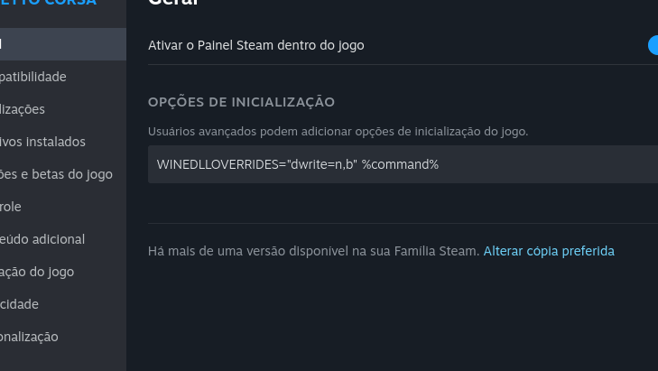

# Assetto Corsa Linux Guide!

Sakaki guide to running Assetto Corsa with Mods (CSP) + Online/LAN + Content Manager on *Linux*.  
*Try also __[Sihawido Guide](https://github.com/sihawido/assettocorsa-linux-setup/), and [ProtonDB](https://www.protondb.com/app/244210)__.*  

### Getting Started

In this guide, I use and recommend the [[GE-Proton9-20]](https://github.com/GloriousEggroll/proton-ge-custom/releases/tag/GE-Proton9-20) version (because it's the simplest version to get the game running), I and the community in general recommend this specific version of GE-Proton because it's one of the few that opens the game almost without problems.  

<<<<<<< HEAD
Remember, Assetto Corsa on Linux is an anomaly, and stability is achieved through unorthodox steps. If it doesn't work, it's NOT my fault, I'm just TRYING to help in any way I can.  

If you encounter any __[problem](https://github.com/sakaki91/Sakaki-AC-Linux-Guide/issues)__, please report it in __AS MUCH DETAIL AS POSSIBLE__.  

__Initially, we will need these basic dependencies:__ `wine, winetricks, steam (or flatpak steam)`

1. [Getting Started](#getting-started)  
	1.1. [Preparing Prefix](#preparing-prefix)  
	1.2. [Game Dependencies](#game-dependencies)  
	1.3. [Modding](#modding)  
    1.4. [Online](#online)  
2. [Known issues](#known-issues)  
3. [Configuration Used](../)  
=======
If you encounter any __[problem](https://github.com/sakaki91/Sakaki-AC-Linux-Guide/issues)__, please report it in __AS MUCH DETAIL AS POSSIBLE__.  

Remember, Assetto Corsa on Linux is an anomaly, and stability is achieved through unorthodox steps. If it doesn't work, it's NOT my fault, I'm just TRYING to help in any way I can.  

__Initially, we will need these basic dependencies:__ `wine, winetricks, steam (or flatpak steam)`

- [Getting Started](#)
	- [Preparing Prefix](#preparing-prefix)
		- [Native](#native)
		- [Flatpak](#flatpak)
	- [Installation](#installation)
		- [Game Dependencies](#dependencies)
		- [Modding](#modding)
		- [Online](#online)
	- [Troubleshooting](#troubleshooting)
	- [Extras](#extras)
	- [Configuration Used](../)
>>>>>>> 3af8ed544580bb3b6c424468e909dbd9746e38fd

### Preparing Prefix

In this guide, we will use the following directory as an example: `~/.steam/steam/steamapps/compatdata/244210`  

or this one (adjusting this if the directories are different): `~/.var/app/com.valvesoftware.Steam/data/Steam/steamapps/compatdata/244210`   

If you have a custom directory on a different disk/partition, the logic remains the same, it would look something like this: `[path]/SteamLibrary/steam/steamapps/compatdata/244210`  

After discovering the path to your prefix, it's necessary to delete the prefix so that we can perform a clean installation of the dependencies using the commands below:  
	
	$ sudo rm -rf ~/.steam/steam/steamapps/compatdata/244210

And if you've already tried installing the game and its dependencies using winetricks, I recommend clearing the winetricks cache just to be safe:  
	
	$ rm -rf ~/.cache/winetricks

Now we prove that the Steam is closed, as we will install the Proton-GE and prepare the prefix manually.

	$ wget -c https://github.com/GloriousEggroll/proton-ge-custom/releases/download/GE-Proton9-20/GE-Proton9-20.tar.gz

Now extract it to the Steam (__Runners folder__):

	$ tar -xvf GE-Proton9-20.tar.gz --directory ~/.steam/steam/compatibilitytools.d

After that, we will include the game prefix path in the *WINEPREFIX* variable with:  

	$ export WINEPREFIX=~/.steam/steam/steamapps/compatdata/244210/pfx

With that ready, you can proceed to installation.  

### Game Dependencies

It is EXTREMELY important that you go through ALL the steps.  
and if you encounter problems (and yes this is more common than it seems) I highly recommend looking at [[Know Issues]](#known-issues).  

Then we will install the game dependencies below:  

	$ winetricks dotnet48
	$ winetricks vcrun2015
	$ winetricks d3dcompiler_47

Next, we'll use the winecfg below to set the version to Windows 10:  

	$ winecfg /v win10

Next, we'll insert the dwrite.dll file so that CSP can be used in the Content Manager, but we'll do it in the Steam arguments:

	WINEDLLOVERRIDES="dwrite=n,b" %command%

__*e.g:*__

After that, switch to [GE-Proton9-20](https://github.com/GloriousEggroll/proton-ge-custom/releases/tag/GE-Proton9-20) on Steam.  

### Modding

Open the Assetto Corsa folder and rename *AssettoCorsa.exe* to *AssettoCorsa_original.exe*, Then download the __[Content Manager](https://acstuff.ru/app/latest.zip)__, and extract it to the main Assetto Corsa folder. Rename *Content Manager.exe* to *AssettoCorsa.exe*.  
Download the __[CSP fonts](https://acstuff.club/u/blob/ac-fonts.zip)__, and extract them to assettocorsa/content/fonts/.  
Then, launch the game via Steam, the Content Manager will then open.  
> [!CAUTION]
> DO NOT CLICK TO CREATE A DESKTOP SHORTCUT IN THE INITIAL CONTENT MANAGER CONFIGURATION, AS IT WILL CRASH AND YOU WILL NEED TO DELETE EVERYTHING RELATED TO IT AND START OVER. Just configure it as you wish, but DO NOT click on "create desktop shortcut".  

Now you can configure and modify it as you wish.  
I recommend using version 0.2.0 of the Custom Shaders Patch, Avoid very new or very old versions! (Both work but with some instability, but I believe that happens even in Windows.)  

### Online

Online mode also works perfectly, both on public Kunos servers and on LAN servers, but requires some adjustments, if your system has a firewall active, you'll need to allow Assetto Corsa ports in your firewall, for example:  

	$ sudo ufw allow 9600:9700/udp && sudo ufw allow 9600:9700/tcp

or approve them in your firewall if you use a different one.  

With this, you will be able to access public servers.  

and to enter private/LAN servers it is more complicated, you will need to click on the Online > Kunos tabs, and add any server to Favorites, after adding, some new tabs will appear within Online: Favorites, Recent and LAN, you will need to open the server through Content Manager (or if your friend opens it you will need his IP, usually it is in Hamachi or Radmin), but if you open the server, the LAN tab of Content Manager for Linux is broken and does not work.  
if your friend is on Windows he will see your server open in LAN, but you will not see it.  

__To enter, you can do the following__: click on the Favorites tab in the Content Manager. In this tab, at the bottom next to the refresh button, you will see the "+" symbol. Click on it to add the server, you can use your local IP address as shown below, and the server will appear for you:  

	127.0.0.1:9600

now you can play the way you want.  

### Know Issues

The guide has been tested on several popular distros and has had the same results on most of them.  

In this tab, we will have the solution, or at least the mapping of known problems in Assetto Corsa running via Wine/Proton!  
If you encounter any undocumented issues, I invite you to open an [issue](https://github.com/sakaki91/Sakaki-AC-Linux-Guide/issues) so we can try to help!

Known issues:
- [[rundll32.exe]: This application could not be started.](#rundll32.exe)  
- [Game does not open even after "installing" the dependencies](#the-game-doesnt-open)

### rundll32.exe

generally the error [rundll32.exe] does not interfere with the game's functioning, the error usually happens, including to me, but it is not something that prevents the game from running, it is probably something missing or being misinterpreted by dotnet48, currently I am trying to map these types of problems to make the game more satisfactory for the community, and obviously for me too!

### The game doesn't open

If your game presents the following situation:  

Know that it could be several things, but generally it tends to be a single reason, the main one being this:

	sakaki@192:~$ export WINEPREFIX=/run/media/sakaki/3bf7c1fb-526d-48ee-9f03-689962c860d2/Jogos/Steam/steamapps/compatdata/244210 (to set the game prefix (located in the steam folder at compatdata/244210/)
	sakaki@192:~$ winetricks annihilate (to erase loose ends of the prefix)
	Executing cd /usr/bin
	------------------------------------------------------
	warning: Você está utilizando o winetricks-20250102, a versão mais recente é winetricks-20260125!
	------------------------------------------------------
	------------------------------------------------------
	warning: Você pode atualizar com o sistema de atualizações da sua distribuição, --self-update, ou manualmente.
	------------------------------------------------------
	------------------------------------------------------
	warning: Você está usando um WINEPREFIX de 64-bit. Observe que muitos casos instalam apenas versões de pacotes de 32-bit. Se você encontrar problemas, teste novamente em um WINEPREFIX limpo de 32-bit antes de relatar um bug.
	------------------------------------------------------
	------------------------------------------------------
	warning: You appear to be using Wine's new wow64 mode. Note that this is EXPERIMENTAL and not yet fully supported. If reporting an issue, be sure to mention this.
	------------------------------------------------------
	Using winetricks 20250102 - sha256sum: c5bfa1741cb6671f1cf3328548a4e878ddf89f7c4f871519ef1037e78c7633d4 with wine-11.0 (Staging) and WINEARCH=win64
	------------------------------------------------------
	Delete /home/user/.wine/, These apps, icons and menu items  
	------------------------------------------------------
	Press Y or N, then Enter: 

can you understand? that even using export WINEPREFIX, for some reason winetricks was unable to pull the variable, I really have no idea what it could be, but I managed to get around it in a simple way, I had this problem EXCLUSIVELY in Fedora Workstation only, but you may be having it, in this case you would just need to set the prefix in all dependency installation lines, for example:  

	$ WINEPREFIX=~/.steam/steam/steamapps/compatdata/244210/pfx winetricks annihilate  
	$ WINEPREFIX=~/.steam/steam/steamapps/compatdata/244210/pfx wine msiexec /i ~/Downloads/wine-mono-9.0.0-x86.msi  
	$ WINEPREFIX=~/.steam/steam/steamapps/compatdata/244210/pfx winetricks dotnet48  
	$ WINEPREFIX=~/.steam/steam/steamapps/compatdata/244210/pfx winetricks vcrun2015  
	$ WINEPREFIX=~/.steam/steam/steamapps/compatdata/244210/pfx winetricks d3dcompiler_47  
	$ WINEPREFIX=~/.steam/steam/steamapps/compatdata/244210/pfx winecfg /v win10  
	$ WINEPREFIX=~/.steam/steam/steamapps/compatdata/244210/pfx wine reg add "HKEY_CURRENT_USER\Software\Wine\DllOverrides" /v dwrite /d native,builtin /f
